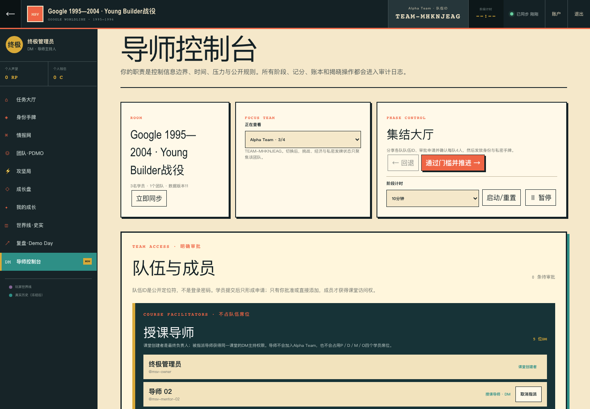

# Mini Silicon Valley 终极管理员／DM 导师主持人操作手册

> 文档类型：生产 WebApp 逐点击 SOP＋现场主持速查＋验收清单
> 适用对象：终极管理员、课堂创建者、被指派的 DM／导师主持人
> 正式入口：<https://minisv.vip/classroom/>
> 界面基线：2026-09-07 `minisv.vip` Course Package 生产版
> 原则：本手册只使用当前界面真实存在的入口、按钮和系统门槛；不要求导师猜测隐藏步骤。

## 目录

1. [五分钟理解账号与课堂关系](#1-五分钟理解账号与课堂关系)
2. [当前测试队伍：从这里开始](#2-当前测试队伍从这里开始)
3. [登录与进入课堂](#3-登录与进入课堂)
4. [终极管理员：从零创建并交接课堂](#4-终极管理员从零创建并交接课堂)
5. [DM：集结、审批、发牌并开局](#5-dm集结审批发牌并开局)
6. [十三阶段逐步主持 SOP](#6-十三阶段逐步主持-sop)
7. [计时、暂停、同步与多团队](#7-计时暂停同步与多团队)
8. [声望、资金、资产与纠错](#8-声望资金资产与纠错)
9. [账号资料与学员密码协助](#9-账号资料与学员密码协助)
10. [禁止误操作清单](#10-禁止误操作清单)
11. [故障排查](#11-故障排查)
12. [现场一页式速查](#12-现场一页式速查)
13. [逐项验收记录](#13-逐项验收记录)

---

## 1. 五分钟理解账号与课堂关系

### 1.1 三层身份不能混用

```text
平台账号角色（RBAC）
admin / mentor / learner / observer
        │
        ├─ 决定能否创建课堂、协助学员、被指派为导师
        ▼
具体课堂角色
room dm / room learner
        │
        ├─ 决定能否主持这一场课堂
        ▼
队伍席位
P / D / M / O，共4名 Young Builder
```

- **终极管理员**：平台角色是 `admin`。可以创建课堂，也可以管理课堂的“授课导师”名单。
- **导师账号**：平台角色是 `mentor`。可以自行创建课堂；若课堂由别人创建，必须由创建者在“授课导师”区域指派后，才会成为该课堂的 `DM`。
- **学员账号**：平台角色是 `learner`。可以自行注册，通过队伍 ID 申请四个学员席位之一。
- **队伍 ID**：形如 `TEAM-XXXXXXXX`，只是公开定位符，不是密码，也不是导师入场方式。

### 1.2 管理员和被指派导师在课堂中的权限

二者进入课堂后都显示：

- `DM · 导师主持人`
- `导师控制台`
- 阶段推进、发牌、挑战投放、公开结算、史实揭晓与导出能力

区别只有一项：

- 课堂创建者／平台管理员可以增删“授课导师”。
- 普通被指派导师只能主持，不能改动授课导师名单。界面会显示：`只有课堂创建者或系统管理员可以增删授课导师；你已拥有本课堂DM主持权限。`

### 1.3 两种“移动”必须分清

```text
顶部13阶段圆点只用于切换查看工作区；左侧工作区按钮同样只切换页面
= 不改变课堂阶段

导师控制台 → PHASE CONTROL → 通过门槛并推进 →
= 真正改变全班阶段；服务器会检查完成证据
```

因此，点击顶部“集结”“身份”“读卡”等圆点，只是在查看对应工作区，不能代替推进。

---

## 2. 当前测试队伍：从这里开始

本轮团队测试使用现有课堂，不要另建测试课堂：

```text
队伍ID：TEAM-MHKNJEAG
队伍：Alpha Team
当前阶段：四人到齐（lobby）
当前学员：3/4
已在队伍：msv-student-02、msv-student-03、msv-student-04
保留给人工申请：msv-student-01
授课导师：msv-mentor-01、02、03、04
课堂最终负责人：msv-owner
```

### 2.1 你现在只需完成的测试

1. 用 `msv-student-01` 登录。
2. 打开：<https://minisv.vip/classroom/?team=TEAM-MHKNJEAG>。
3. 核对输入框显示 `TEAM-MHKNJEAG`。
4. 点击 `提交入队申请 →`。
5. 换到 `msv-owner` 或任一 `msv-mentor-01/02/03/04` 的独立浏览器窗口。
6. 进入该课堂，点击 `现在做什么`。
7. 点击 `去导师控制台完成当前阶段：四人到齐 →`。
8. 在 `队伍与成员 → 待审批申请` 找到 `msv-student-01`，点击 `批准加入`。
9. 确认 Alpha Team 变成 `4/4 BUILDERS`，成员恰好为 01、02、03、04。
10. 只有准备正式开局时，才点击 `随机分配身份与发牌`。

> 不要把临时账号 `lintron` 加回队伍，否则会占掉第4席。

### 2.2 当前卡点的正确结果

在“现在做什么”点击当前阶段按钮后，应发生三个可见变化：

- 左侧 `导师控制台` 变为选中状态。
- 主内容标题变为 `导师控制台`。
- 页面自动把焦点和视图移到主工作区。

按钮不应再把 DM 导回原地，也不需要 `Ctrl`／`Command` 点击。


点击后的生产界面应如下：左侧“导师控制台”高亮并带 `NOW`，主工作区显示阶段控制、队伍与成员及授课导师。



---

## 3. 登录与进入课堂

### 3.1 登录

1. 打开 <https://minisv.vip/login/>。
2. 输入用户名和密码。
3. 点击 `登录并继续 →`。
4. 登录成功后进入应用；若没有自动进入课堂，打开正式课堂入口。

注意：

- 管理员、导师和学员都使用同一个登录页。
- 不使用浏览器弹出的 Basic Auth 对话框。
- 每个测试账号使用独立浏览器配置文件或无痕窗口，避免 cookie 串号。
- 不在截图、群聊或缺陷单中粘贴密码、cookie 或一次性重置链接。

### 3.2 识别自己是否进入了正确角色

课堂列表页顶部应显示：

- 管理员：`系统管理员`
- 导师：`DM导师`
- 学员：`Young Builder`

管理员／导师还会看到：

- `创建一场新战役`
- `受邀带领已有课堂`，或已经被指派的课堂卡片

已获课堂主持权限的房间，在 `继续你的课堂` 中显示 `DM` 标签。点击课堂卡片进入。

### 3.3 进入房间后的四个固定区域

1. **顶部栏**：返回、课堂名、聚焦队伍 ID、计时器、同步状态、账户、退出。
2. **阶段栏**：13个阶段查看入口；当前阶段高亮。
3. **NOW 区**：当前阶段、DM动作、完成证据和进入当前工作区按钮。
4. **左侧工作区**：现在做什么、我的角色和线索、团队线索墙、四人分工、动手解决、团队钱箱与工具、我的成长记录、我们 vs 历史、总结与发布、导师控制台。

---

## 4. 终极管理员：从零创建并交接课堂

若使用当前现有测试课堂，跳到[第5节](#5-dm集结审批发牌并开局)。

### 4.1 创建课堂

1. 进入课堂列表。
2. 在 `创建一场新战役` 卡片中填写 `课堂名称`。
3. 点击 `创建课堂与首支队伍 →`。
4. 系统自动创建课堂和 Alpha Team，并进入房间。
5. 保持阶段为 `四人到齐`。

**预期结果**：顶部显示课堂名；队伍卡显示一个稳定的 `TEAM-XXXXXXXX`；Alpha Team 为 `0/4 BUILDERS`。

### 4.2 指派授课导师

1. 点击左侧 `导师控制台`。
2. 找到 `队伍与成员 → 授课导师`。
3. 在 `导师用户名` 输入准确用户名，例如 `msv-mentor-01`。
4. 点击 `指派为授课导师 →`。
5. 对其他导师重复操作。

**预期结果**：

- 名单中课堂创建者标记为 `课堂创建者`。
- 新导师标记为 `授课导师 · DM`。
- 新导师重新打开课堂列表后，该课堂自动出现在 `继续你的课堂`，并带 `DM` 标签。
- Alpha Team 学员人数不变；导师没有席位号。

**如果提示账号不匹配**：

- 必须输入导师的登录用户名，不是昵称。
- 对方平台角色必须是 active `mentor` 或 `admin`。
- 不要在下方“按学员ID或昵称直接添加”中添加导师；那个入口只管理 Young Builder。

### 4.3 分享学员入队入口

1. 在 Alpha Team 卡片点击 `复制入队链接`。
2. 把链接私下发给目标学员。
3. 也可点击 `复制队伍ID`，但优先发链接，避免学员粘贴到旧 ID。

**预期结果**：学员登录后，页面自动填入该队伍 ID，并显示 `✓ 入队链接已填入`。

### 4.4 将课堂交给导师

1. 让导师使用自己的账号重新打开课堂列表。
2. 确认导师看到 `DM` 标签，而不是队伍申请框。
3. 让导师进入房间并打开 `导师控制台`。
4. 确认导师能看到：`PHASE CONTROL`、`队伍与成员`、`当前明确操作`。
5. 确认导师不能看到“指派为授课导师”表单，而看到权限说明文字。

到这里，管理员可以继续作为主DM，也可以只保留最终负责人身份，由被指派导师主持。

---

## 5. DM：集结、审批、发牌并开局

### 5.1 从现在做什么进入可操作页面

1. 进入带 `DM` 标签的课堂。
2. 当前阶段应为 `四人到齐`。
3. 点击 NOW 区中的 `进入导师控制台 →`；或在现在做什么底部点击 `去导师控制台完成当前阶段：四人到齐 →`。
4. 确认主内容标题为 `导师控制台`。

也可以直接点击左侧 `导师控制台`。三种入口应到达同一页面。

### 5.2 审批学员申请

1. 向学员发送 Alpha Team 的 `复制入队链接`。
2. 学员自行提交后，保持在 `导师控制台`。
3. 找到 `队伍与成员 → 待审批申请`。
4. 核对学员显示名称、`@用户名`、目标队伍名和队伍 ID。
5. 点击 `批准加入`；明显错误的申请点击 `拒绝`。
6. 看见顶部提示 `已完成` 后，核对队伍人数。

申请只在 `四人到齐` 开放。课堂开始后，审批、新队伍和直接添加会锁定。

### 5.3 不等待申请，直接添加学员

1. 找到 `按学员ID或昵称直接添加`。
2. 输入至少2个字符。
3. 在 `加入队伍` 选择目标队伍。
4. 点击 `查找`。
5. 在准确的学员结果旁点击 `直接添加`。

这里无法添加 `mentor/admin`，这是正确的 RBAC 边界。

### 5.4 满员检查

发牌前逐项核对：

- Alpha Team 显示 `4/4 BUILDERS`。
- 四个成员都是 `learner`，每人有不同席位号。
- 导师只出现在 `授课导师`，不出现在学员成员列表。
- 没有错误学员或重复账号。
- 课堂仍处于 `四人到齐`。

### 5.5 随机分配身份与发牌

**规则**：身份与完整12张牌池分别随机；每人抽3张且不按角色绑定。卡片原稿中的角色字段只供内容编写追溯，不决定谁拿到哪张卡。

1. 在 `当前明确操作` 找到第2项 `随机分配身份与发牌`。
2. 点击 `随机分配身份与发牌`。
3. 等待顶部显示 `已完成`。
4. 确认第2项变为 `本章已经发放，不能重复发牌`。
5. 确认课堂自动进入 `拿到角色任务`。

**重要**：发牌动作会自动从“四人到齐”进入“拿到角色任务”。不要在发牌前反复点击 `通过门槛并推进 →`；服务器会因未满4人或未发牌而拒绝。

---

## 当前13阶段显示文案

四人到齐、拿到角色任务、打开三张线索、讲给队友听、把线索连起来、用五句话说清问题、商量怎么一起做、第一次试做、根据反馈改一次、算账和选工具、我们的选择 vs 历史、说清学到和下一步、完成六分钟发布。

## 6. 十三阶段逐步主持 SOP

### 6.0 通用主持动作

每个阶段都按同一顺序。**初中生不先学术语**，导师也不要先讲一段方法论：

1. **做**：看 NOW 区和“照着三步做”，让学员先完成具体动作。
2. **说**：请学员指出自己看见、做出或改动了什么，并拿出卡片／便签／作品。
3. **导师命名**：只在这时用一句话说明背后的 PDMO、证据、迭代或经济概念。
4. **再做**：让学员立刻改一条线、一个决定、一个做法或一笔预算。
5. 等学员提交后点击 `立即同步`，或等待3秒自动同步。
6. 在对应工作区核对“完成证据”。
7. 回到 `导师控制台 → PHASE CONTROL`，点击 `通过门槛并推进 →`。
8. 如果出现红色 `这一步没有发生`，按错误内容补齐，不要绕过。

### 6.1 阶段1：四人到齐

**DM工作区**：`导师控制台`
**完成证据**：每队恰好4名学员；导师不占学员席位。

操作：

1. 审批／直接添加至4/4。
2. 点击 `随机分配身份与发牌`。
3. 系统自动进入阶段2。

### 6.2 阶段2：拿到角色任务

**共同查看**：`我的角色和线索`
**学员动作**：只读自己的身份目标、顾虑和一次能力。
**DM动作**：逐人确认其能用自己的话说出身份目标，不解释历史答案。

操作：

1. 点击左侧 `我的角色和线索`。
2. DM只能投屏规则和公开身份结构，不投屏私密卡全文。
3. 逐人确认理解。
4. 回到 `导师控制台`，点击 `通过门槛并推进 →`。

### 6.3 阶段3：打开三张线索

**工作区**：`我的角色和线索`
**系统门槛**：所有私密卡都不再是“未阅读”。

学员逐人操作：

1. 找到标有 `随机线索 1/3`、`2/3`、`3/3` 的卡。
2. 点击 `打开这张线索`。
3. 圈出“卡上确定写了什么”和“我还不确定什么”；事实、观点、推断或传闻由导师随后命名。
4. 对自己的3张卡重复。

DM看到全部卡片阅读完毕后推进。若失败，红色提示会明确显示还有多少张未读。

### 6.4 阶段4：讲给队友听

**工作区**：`我的角色和线索`
**系统门槛**：每名 active 学员至少发布1张卡。

每名学员：

1. 先在线下用自己的话讲，说明来源和不确定性。
2. 接受队友追问。
3. 再点击 `我已当面讲解，发布到团队`。

DM只用“你凭什么相信？”追问。确认每人至少贡献1张后推进。

### 6.5 阶段5：把线索连起来

**工作区**：`团队线索墙`
**系统门槛（导师端检查；学员只按页面便签任务操作）**：

- 至少2个引用已发布卡片的来源节点。
- 至少1个 `人物` 或 `用户` 节点。
- 至少1个 `约束` 节点。
- 至少1条 `矛盾` 或 `限制` 关系。

学员操作：

1. 在 `贴一张新便签` 选择“遇到麻烦的人／他卡住的事／有来源的线索”等具体类型。
2. 填写 `用一句短话命名` 和 `具体发生了什么`。
3. 勾选“这句话来自哪张已讲出的线索”；没有来源的便签会明确标成团队猜测。
4. 点击 `贴到团队线索墙`。
5. 至少有2张便签后，在 `给两张便签连线` 依次选择两张便签和“会导致／能证明／会卡住／说法冲突／我们猜的”。
6. 在 `把“因为”说完整` 写一句完整理由，点击 `画出这条解释线`。

DM按页面进度清单逐项核对，再推进到认知门。

### 6.6 阶段6：用五句话说清问题

**工作区**：`团队线索墙`
**系统门槛**：每支队伍提交一份完整问题陈述。

由团队选一名学员填写：

1. `谁正在做这件事`
2. `他在哪里、哪一步卡住，造成什么麻烦`
3. `哪两张线索或哪次观察支持这句话`
4. `我们还不知道什么`
5. `下一步要做哪个小测试`
6. 点击 `保存这5句话`

DM要求团队当面讲清五项内容，只追问证据缺口。页面出现 `✓ TEAM STATEMENT` 后，回导师控制台推进。

### 6.7 阶段7：商量怎么一起做

**工作区**：`团队协作`
**系统门槛**：四人作为同一个 Young Builder Team，共同说清负责人、支援者、完成时间和检查结果；P／D／M／O 只存在于导师专业线。

入门模式：

1. 四人围绕同一张问题卡，口头商量第一步做什么。
2. 每人说出自己准备补上的一项具体行动，以及需要谁帮助。
3. DM确认团队听懂彼此后，直接点击 `通过门槛并推进 →`。

页面不提供学员 P／D／M／O 认领。需要更清楚的责任边界时，直接记录“谁先做哪件事、谁支援、何时完成、留下什么作品”；下一轮可以换负责人。

### 6.8 阶段8：第一次试做

**工作区**：`动手解决`
**系统门槛**：每支队伍已锁定挑战；每名学员提交第一轮行动。

DM先操作：

1. 若有多队，在导师控制台 `FOCUS TEAM → 正在查看` 选择目标队伍。
2. 进入 `动手解决`。
3. 在 L1／L2／L3 中点击 `选择此难度`。
4. 点击 `投掷压力骰`。骰子只选择情境压力，不决定成绩。

每名学员在“把做法拆成6个小格”提交：

- 这轮要做出什么
- 第一步怎么做
- 哪张线索支持这样做
- 要用什么人、时间或工具
- 看到什么就算有效
- 出现什么就停下来换办法

点击 `交出第1版做法`。全员提交后，DM回控制台推进；系统会把挑战轮次切到第2轮。

### 6.9 阶段9：根据反馈改一次

**工作区**：`动手解决`
**系统门槛**：每支队伍完成第二轮，并由DM公开结算。

每名学员：

1. 基于反馈重新填写行动。
2. 至少改变目标、方法、证据、资源、成功信号或停止条件之一。
3. 点击 `交出第2版做法`。

全员第二轮完成后，DM：

1. 勾选公开量规：`证据`、`逻辑`、`执行`、`协作`，每项0或1。
2. 总分2分以下时填写 `世界线后果`。
3. 点击 `按四项量规公开结算`。
4. 核对结果卡、分数、项目收入和后果。
5. 多团队逐队完成后再推进。

### 6.10 阶段10：算账和选工具

**主要工作区**：`团队钱箱与工具`；个人操作在 `我的成长记录`；个人RP结算在 `导师控制台`。

建议顺序：

1. DM在 `导师控制台` 用作品证据为学员结算RP：选择学员、六维分值、填写理由，点击 `结算这份作品的RP`。
2. 在 `团队钱箱与工具` 核对团队金库、可分配利润、资产和公开账本。
3. 学员可发起团队资产购买；其他学员 `赞成`／`反对`，超过半数后系统原子扣款。
4. 学员在 `我的成长记录` 记录 `协作感谢`；可自愿 `返投团队`，也可用个人钱包购买行动工具。
5. DM按课堂决定执行 `一次性分配`；融资或纸账本补录必须写明条件／原因。
6. 错误账目只能点击 `冲正` 并填写至少8个字的原因，不能删除原交易。
7. 完成后回导师控制台推进到史实阶段。

团队钱箱与工具没有强制消费门槛，但课堂应至少留下RP、账本与经营决策证据。

### 6.11 阶段11：我们的选择 vs 历史

**工作区**：`我们 vs 历史`
**系统门槛**：所有团队先冻结玩家决定，DM再揭晓史实。

每支队伍由一名学员操作：

1. 填写 `团队决定`。
2. 填写 `证据与理由`。
3. 团队确认后点击 `确认团队同意并冻结`。
4. 冻结后不可覆盖。

全部团队冻结后，DM点击：

- 当前工作区中的 `所有团队已冻结，揭晓真实历史`；或
- 导师控制台“当前明确操作”中的 `揭晓史实`。

核对真实历史、来源和边界已显示，再回导师控制台点击 `通过门槛并推进 →`。

### 6.12 阶段12：说清学到和下一步

**工作区**：`总结与发布`
**系统门槛**：每名学员提交6个短问题和未来2天的小任务。

每名学员：

1. 逐题填写六问。
2. 在 `未来2天，我要完成这件小事` 写明完成时间、交出什么和找谁检查。
3. 点击 `提交并写入成长档案`。

DM注意：此阶段 `PHASE CONTROL` 的推进按钮不可用。必须在导师控制台页面底部点击：

- 非最后一章：`全部复盘完成，进入下一章`
- 所选课件的最后一章：`完成本次课件` 或 `完成5章战役`

服务器会检查每名学员是否完成复盘。进入下一章后，课堂回到 `四人到齐`；成员保留，但必须为新章重新发身份和卡。

### 6.13 阶段13：完成六分钟发布

所选课件最后一章的复盘阶段会出现六段式团队发布表单。Google 和饿了么均为五步；Demo 在第 5 步完成后提交。团队：

1. 填写发布标题。
2. 按六段填写问题证据、方案取舍、MVP 演示、用户／市场证据、运营账本、下一步请求。
3. 点击 `提交团队六分钟发布作品`。
4. DM使用阶段计时选择 `6分钟`，点击 `启动/重置` 主持现场发布。
5. 所有团队提交且所有学员复盘完成后，DM点击页面显示的“完成本次课件／完成5章战役”。
6. 房间进入 `完成六分钟发布`。
7. 点击 `↓ 导出完整课堂档案`，确认JSON文件可打开。
8. 只有明确不再写入时，才点击 `归档课堂`。

---

## 7. 计时、暂停、同步与多团队

### 7.1 共享计时

路径：`导师控制台 → PHASE CONTROL → 阶段计时`

1. 选择3、5、6、8、10、15、20、30或45分钟。
2. 点击 `启动/重置`。
3. 所有人顶部看到同一个计时器。

### 7.2 暂停课堂

- 点击 `Ⅱ 暂停`：学员仍可讨论，但新提交会被服务器锁定；计时暂停。
- 点击 `▶ 恢复`：恢复提交，计时顺延。
- 不要用浏览器刷新代替暂停。

### 7.3 同步

- 页面每3秒自动同步。
- 顶部 `已同步 …` 表示在线。
- 需要立即核对时，在导师控制台点击 `立即同步`。
- 显示 `离线·保留当前画面` 时，不要重复点击结算；先恢复网络。

### 7.4 多团队

1. 只在四人到齐使用 `创建队伍与独立队伍ID` 创建 Beta Team 等。
2. 每队有独立队伍 ID 和4个席位。
3. 在 `FOCUS TEAM → 正在查看` 切换聚焦团队。
4. 挑战、经济、私密发牌状态按聚焦团队显示。
5. 阶段门槛会检查所有团队，不只检查当前聚焦队伍。

---

## 8. 声望、资金、资产与纠错

### 8.1 三个账户

```text
个人声望 RP：个人长期成长与资格；不能购买、转让或兑换现金
团队资金 C：团队共同的商业资源；团队决策使用
个人钱包 C：个人分配所得；可返投或购买个人行动工具
```

### 8.2 RP结算

路径：`导师控制台 → 为具体作品结算个人声望`

- 必须选择具体学员。
- 六维上限合计12：证据2、建模2、交付3、支撑2、迭代2、责任1。
- `作品证据与理由` 必填，不能给印象分。
- 点击 `结算这份作品的RP` 后进入长期账户。

### 8.3 团队资金

在团队钱箱与工具：

- `执行一次性分配`：只允许0%、20%、40%。
- `记录融资`：资金进入团队金库，但不计入可分配利润；附带条件必填。
- `带原因补录`：仅用于签字纸单恢复；区分收入／支出和类别。
- `冲正`：原记录保留，新增反向交易和原因。

### 8.4 资产购买

- 学员发起购买提案。
- 团队超过半数赞成后才扣款。
- 资产可能有RP门槛和维护成本。
- DM审核规则与余额，不替团队判断值不值得买。

---

## 9. 账号资料与学员密码协助

### 9.1 修改自己的资料与密码

路径：顶部 `账户` → `Young Builder 账户`

- `课堂身份`：修改显示名称；用户名保持稳定。
- `更新密码`：输入当前密码和不少于12字符的新密码。
- `登录设备`：退出不认识的设备或退出当前账号。

### 9.2 帮助普通学员重置密码

管理员／导师可从两个入口操作：

- `账户中心 → 帮助学员重置密码`
- `导师控制台 → 队伍与成员 → 学员旁的“重置密码”`

步骤：

1. 搜索自己有权协助的课堂学员或待审批学员。
2. 点击 `生成重置链接` 或成员旁的 `重置密码`。
3. 复制仅展示一次的链接，私下发给目标学员。
4. 链接30分钟有效，只能使用一次。
5. 学员自行设置新密码；导师看不到新密码。

管理员／导师等特权账号不走学员网页找回流程，由后台维护。

---

## 10. 禁止误操作清单

### 开局前不要做

- 不要让导师输入队伍 ID 申请学员席位。
- 不要在“按学员ID或昵称直接添加”中搜索导师。
- 不要在4名学员未到齐时发牌或推进。
- 不要把队伍 ID 当密码公开解释。

### 课堂中不要做

- 不要点击顶部阶段圆点后误以为全班已经推进。
- 不要替学员打开、发布或填写私密作品。
- 不要提前展示真实历史。
- 不要因为骰面给学员扣RP。
- 不要绕过红色门槛提示。
- 不要重复点击资金结算；等待“已完成”或同步结果。

### 收尾时不要做

- 未确认全部复盘前，不进入下一章。
- 未确认所有团队作品前，不完成战役。
- 未下载并检查档案前，不归档。
- `归档课堂` 会让房间只读；不是普通“退出课堂”。

---

## 11. 故障排查

### 11.1 点击“去完成当前阶段”没有变化

**新版预期**：四人到齐中的DM会进入 `导师控制台`，页面滚动并聚焦主工作区。

处理：

1. 普通单击，不使用 Ctrl／Command。
2. 看左侧 `导师控制台` 是否高亮。
3. 若仍显示旧文案 `去完成当前阶段：四人到齐 →`，执行一次强制刷新。
4. 也可直接点击左侧 `导师控制台`；记录浏览器、时间和截图。

### 11.2 点击“通过门槛并推进”出现红色提示

这不是页面坏了。标题 `这一步没有发生` 表示服务器拒绝了未完成阶段。

常见提示：

- `至少需要4名学员加入后才能开局`：补足学员。
- `请先在导师控制台随机分配身份，并让每人从完整12张牌池中随机抽取3张线索卡`：点击随机发牌。
- `还有N张随机线索没有被抽到它的学员打开`：让对应学员依次点击 `打开这张线索`。
- `每个人都要先当面讲完至少1张线索，再点击发布到团队`：补齐当面讲解和发布。
- `还有队的线索墙没做完…`：让学员补便签和完整的“因为…所以…”解释线；导师负责对应抽象门槛。
- `每队都要保存5句话…`：补齐谁、卡住处、两张线索、未知和下一步小测试。
- `团队计划还没有说清…`：补齐负责人、至少一名支援者、完成时间和可检查结果；不要改用 P／D／M／O 学员标签绕过。
- `每个人都要先交出第1版做法`：补齐第一版。
- `每队4人都要交出第2版做法…`：补齐第二版，再由导师公开结算。
- `请先让每队锁定“我们会怎么做”…`：全部队伍锁定后再打开历史。

### 11.3 导师看不到管理员创建的课堂

1. 管理员进入该课堂。
2. 打开 `导师控制台 → 授课导师`。
3. 输入导师准确用户名并点击 `指派为授课导师 →`。
4. 导师刷新课堂列表。

导师不要提交队伍 ID；`只有学员账号可以申请席位` 是正确提示。

### 11.4 学员说队伍不存在

1. DM重新点击 `复制入队链接`。
2. 学员打开链接后核对回显的完整 `TEAM-XXXXXXXX`。
3. 不要沿用剪贴板中的旧值。
4. 确认课堂仍在四人到齐且席位未满。

### 11.5 按钮是灰色

先检查按钮旁的前置条件：

- 发牌：至少4名学员。
- 审批／直接添加／建队：仅四人到齐。
- 连接节点：至少2个节点。
- 购买：阶段、RP、余额和投票条件。
- 历史揭晓：阶段必须是史实，且所有团队已冻结。
- 下一章：所有学员复盘完成。

### 11.6 页面没有队友最新进展

1. 等待3秒。
2. 确认顶部为 `已同步`。
3. 点击 `立即同步`。
4. 网络恢复前不要重复提交结算。

### 11.7 普通链接点击无反应

登录、注册、找回、账户和课堂跨页入口都应支持普通单击。若仍复现：

1. 强制刷新。
2. 记录链接文字、当前地址、点击后的地址、浏览器版本和时间。
3. 不把 Ctrl／Command 点击当作长期解决办法。

---

## 12. 现场一页式速查

```text
登录
课堂列表 → 找到 DM 标签课堂 → 点击课堂卡

集结
现在做什么 → 去导师控制台完成当前阶段：四人到齐 →
→ 队伍与成员 → 审批至4/4
→ 随机分配身份与发牌（自动进入拿到角色任务）

每阶段
NOW看动作和证据
→ 进入对应工作区
→ 学员完成并同步
→ 导师控制台 / PHASE CONTROL
→ 通过门槛并推进

阶段—工作区
01 四人到齐       DM：导师控制台
02 拿到角色任务       我的角色和线索
03 打开三张线索       我的角色和线索
04 讲给队友听         我的角色和线索
05 把线索连起来       团队线索墙
06 用五句话说清问题   团队线索墙
07 商量怎么一起做       团队协作（负责人＋支援者＋检查结果）
08 第一次试做         动手解决
09 根据反馈改一次     动手解决
10 算账和选工具       团队钱箱与工具／我的成长记录／导师控制台
11 我们的选择 vs 历史 我们 vs 历史
12 说清学到和下一步   总结与发布
13 完成六分钟发布     总结与发布／导师控制台导出

收尾
每人6个短问题＋未来2天的小任务
→ 第1—4章：全部复盘完成，进入下一章
→ 最后一步：六段作品＋共享 6 分钟 → 完成所选课件战役
→ 导出档案 → 确认无误后才归档
```

---

## 13. 逐项验收记录

### 13.1 终极管理员路径

- [ ] 使用管理员账号普通登录成功。
- [ ] 课堂列表显示 `系统管理员`。
- [ ] 能创建课堂与首支队伍。
- [ ] 能在 `授课导师` 指派准确导师用户名。
- [ ] 导师指派后不占学员席位。
- [ ] 能复制队伍 ID 和入队链接。
- [ ] 能批准、拒绝、直接添加和移出学员。
- [ ] 能生成普通学员单次密码重置链接。

### 13.2 被指派DM路径

- [ ] 课堂以 `DM` 标签自动出现在列表。
- [ ] 不需要队伍 ID，也不占 P／D／M／O 席位。
- [ ] 能进入 `导师控制台`。
- [ ] 能看到主持功能，但不能改导师名单。
- [ ] 当前阶段按钮会进入正确工作区并产生焦点／滚动反馈。
- [ ] 能发牌、计时、暂停、推进、结算、揭晓和导出。

### 13.3 当前测试队伍（非破坏性预检）

- [ ] TEAM-MHKNJEAG 仍为 active/lobby。
- [ ] 学员02、03、04在第1、2、3席。
- [ ] 学员01尚未加入，保留人工申请。
- [ ] 四位导师和课堂创建者都能以DM身份看到课堂。
- [ ] 任一被指派导师进入后，Alpha Team仍为3/4。
- [ ] 未点击发牌、阶段推进、资金结算、史实揭晓或归档。

### 13.4 缺陷记录模板

```text
环境：生产 / 浏览器 / 桌面或手机宽度
账号角色：终极管理员 / DM（不写密码）
课堂：课堂显示名 + TEAM-XXXXXXXX
当前阶段：
入口或按钮原文：
操作步骤：
预期结果：
实际结果：
红色提示原文：
截图时间：YYYY-MM-DD HH:mm（Asia/Shanghai）
```

## 相关文档

- [DM／导师完整课程主持手册](./DM_MENTOR_MANUAL.md)
- [团队五人验收手册](./TEAM_ACCEPTANCE_GUIDE.md)
- [认证与RBAC设计](./AUTHENTICATION.md)
- [正式部署说明](./DEPLOYMENT.md)
- [当前生产发布回执](./CLASSROOM_RELEASE_RECEIPT.md)
